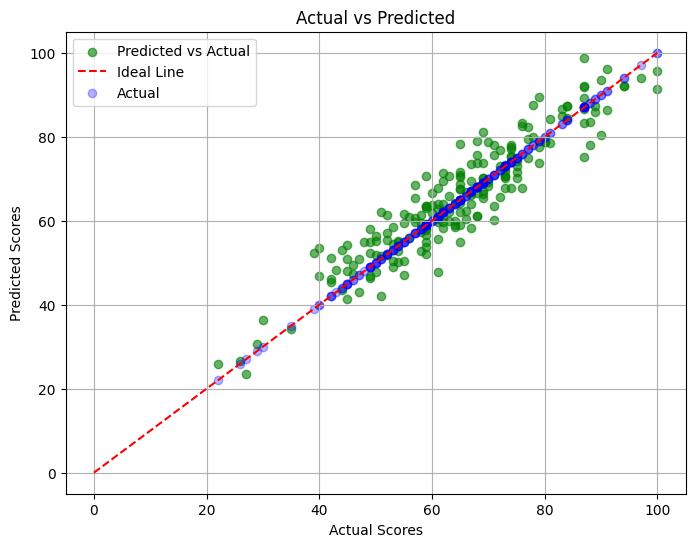

# Student-Performance-Analysis

This project analyzes student performance data using Python and machine learning.  
We use various features like study time, absences, parental education, and more to predict students' final grades.

## Goal
To explore the factors that affect student performance and use a predictive model to estimate final exam scores.

## Files Included
- `student_performance_analysis.ipynb`: The main Jupyter notebook containing data exploration, visualizations, and the machine learning model.
- `README.md`: This file.

## Tools and Libraries Used
- Python
- Pandas
- NumPy
- Matplotlib / Seaborn
- Scikit-learn

## What We Did
- Loaded and cleaned the student dataset
- Explored feature relationships (study time, failures, absences, etc.)
- Visualized trends using plots
- Trained and evaluated a regression model to predict final scores

## Results
The model shows promising predictions for student performance, and the notebook highlights the most influential features.

## How to Use
1. Clone the repository:
   ```bash
   git clone https://github.com/your-username/Student-Performance-Analysis.git

## Sample Output

